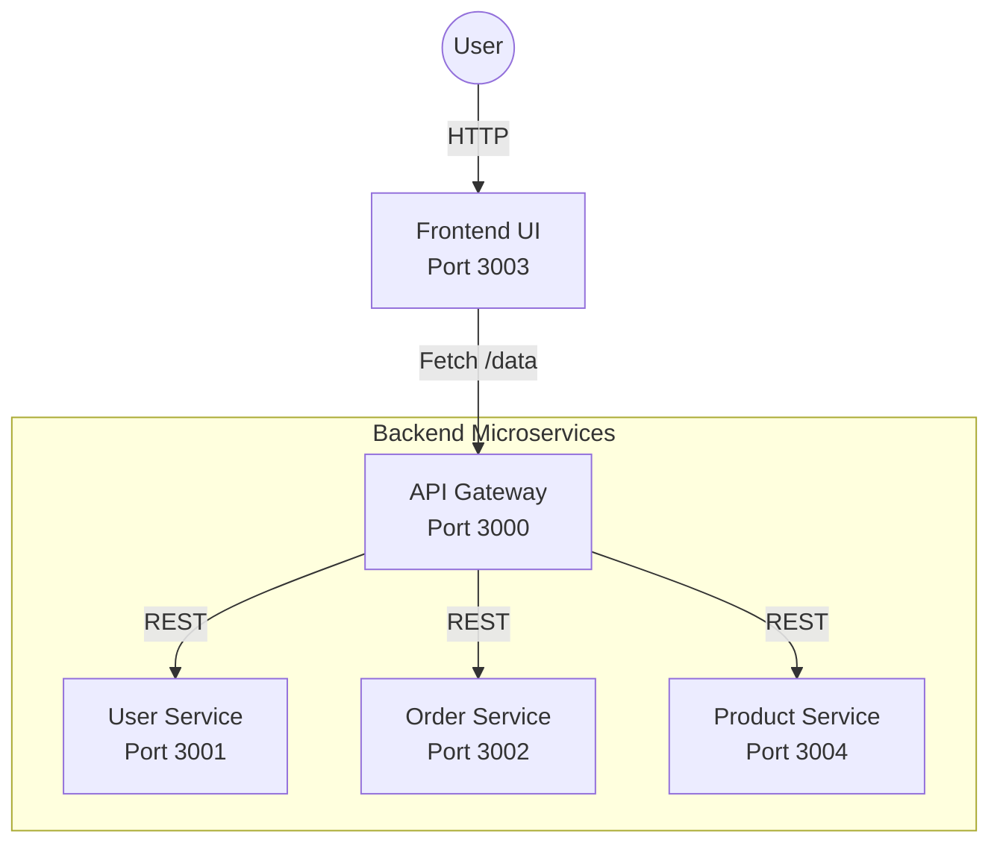

# MicroPlay Demo Architecture


[](https://nodejs.org/)
[](https://playwright.dev/)

**An Enterprise-Grade Microservices Reference Implementation.**
Demonstrating scalable architecture, gateway aggregation, and robust end-to-end validation strategies.

---

## 🏗 System Architecture

This project simulates a **Production-Ready Distributed System** where the UI decouples from backend services via a unifying API Gateway.



### 🚀 Key Features
- **Gateway Pattern**: Aggregates data from multiple sources (Users, Orders, Products) into a single response.
- **Microservices Proper**: Independent Node.js services running on dedicated ports.
- **Resilient Frontend**: Decoupled UI with CORS-enabled secure communication.
- **Enterprise Testing**: Validated with a multi-layer Playwright suite (E2E, API, Mock, Perf).

---

## 🛠 Service Mesh

| Service | Port | Description |
| :--- | :--- | :--- |
| **API Gateway** | `3000` | Aggregation layer; Single Entry Point. |
| **User Service** | `3001` | Manages user identities. |
| **Order Service** | `3002` | Tracks customer orders. |
| **UI** | `3003` | Customer-facing Dashboard. |
| **Product Service** | `3004` | **[NEW]** Product catalog management. |

---

## 🧪 Enterprise Testing Strategy

Employed a **Test Pyramid** approach to ensure quality at speed.
Full details available in [Test Cases Documentation](testcases.md).

### 1. API Contract Testing (Integration)
Directly validates microservice responses and schemas.
- **File**: `tests/api.spec.ts`
- **Coverage**: Json Schema Validation, Data Integrity.

### 2. Resilience & Performance (Negative)
Ensures system stability under failure conditions.
- **File**: `tests/api-negative.spec.ts`
- **Coverage**: 404 Handling, Response Time SLAs (<200ms).

### 3. Frontend Isolation (Mocking)
Tests UI logic without backend dependencies.
- **File**: `tests/ui-mock.spec.ts`
- **Coverage**: Edge cases, Empty States, Backend Outages.

### 4. End-to-End User Journey (E2E)
Validates the complete flow from User -> UI -> Gateway -> Services.
- **File**: `tests/e2e-ui.spec.ts`
- **Coverage**: Full system integration check.

---

## ⚡ Quick Start

Bring up the entire stack (Gateway + 3 Microservices + UI) in one command.

```bash
# 1. Install Dependencies
npm install

# 2. Launch Ecosystem
npm start
```
*Access the UI at: [http://localhost:3003](http://localhost:3003)*

### Run Automated Tests
Execute the full regression suite:
```bash
npx playwright test
```
